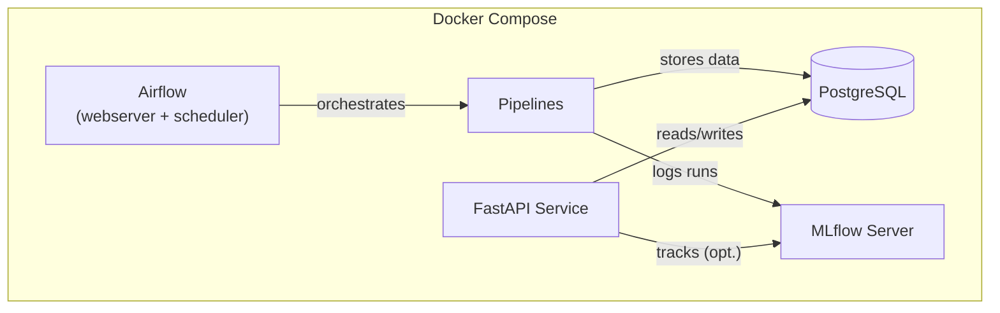

# news-topics-ner

End-to-end NLP system for **topic detection** and **named entity recognition (NER)** on news articles, built as a reproducible ML Engineer technical project.

It includes:

- **Batch pipelines** (ingestion, training, inference)
- **Orchestration** with **Apache Airflow**
- **Experiment tracking** with **MLflow**
- **Model serving** via **FastAPI**
- **Persistence** in **PostgreSQL** (business DB + Airflow DB + MLflow DB)

---

## High-level architecture



---

## Repository structure (key folders)

- `src/news_nlp/`  
  Core package: API, pipelines, topic detector, NER extractor, DB layer, configs.
- `airflow_dags/`  
  Airflow DAG definitions that execute pipelines/jobs.
- `db/`  
  Postgres initialization SQL + business schema.
- `docker-compose.yml`, `docker/app.Dockerfile`  
  Local reproducible environment.
- `data/compressed/data.zip`  
  Dataset bundle (extracted automatically on first ingestion run).
- `docs/`  
  Project documentation.

> Note: model artifacts are generated at runtime under `models/` and are **not versioned** in Git (see `.gitignore`).

---

## Quickstart (Docker)

### 1) Create your environment file

From repo root:

```bash
cp .env.example .env
```

Edit `.env` and set at least:

- `OPENAI_API_KEY` (required for the topics training pipeline, used to generate topic names via LLM)

The rest of values in `.env.example` are already consistent with the Docker setup (local-only credentials).

### 2) Build and start services

```bash
docker compose up --build
```

### 3) Access UIs and services

Default ports (from `.env.example`):

- Airflow UI: `http://localhost:8080`
- MLflow UI: `http://localhost:5000`
- API (Swagger): `http://localhost:8000/docs`
- Postgres: `localhost:5432`

Health check:

```bash
curl -s http://localhost:8000/health | jq
```

---

## What gets created at runtime (reproducibility notes)

This repo is designed so another person can clone it and reproduce the system without pre-existing local state.

During execution, the following are created locally (and are ignored by Git):

- `data/raw/` and `data/processed/`  
  On first ingestion, `data/compressed/data.zip` is extracted into `data/raw/`.
- `models/`  
  - Topics detector artifacts are saved under `models/topics_detector/` (e.g., per-run folders)
  - spaCy model is downloaded (if missing) and stored under `models/ner_extractor/`
- MLflow artifacts are stored in the Docker volume `mlflow_artifacts`.

---

## Airflow DAGs (how to run the project)

Airflow is the recommended way to run the pipelines end-to-end.

### 01 — Initial setup (manual trigger)

DAG id: `01_news_topics_ner_initial_setup`

Purpose:
1) Load initial news splits (`train`, `test`) into the DB  
2) Train the topics detector model (logs to MLflow and writes run metadata to Postgres)  
3) Run full inference for `train,test` (topics + entities)

Trigger it from the Airflow UI.

### 02 — Retrain (manual trigger)

DAG id: `02_news_topics_ner_retrain`

Purpose:
1) Retrain topics detector  
2) Recompute full inference using the new active run (configured as overwrite + incremental modes)

### 03 — Daily ingestion simulation + inference (scheduled)

DAG id: `03_news_topics_ner_daily_ingestion_and_inference`

Purpose:
1) Simulates a “production” feed by ingesting a fraction of the TSV into `prod` in periodic runs.
2) Runs incremental full inference (topics + entities) for newly ingested `prod` news.

Current schedule in code: every 10 minutes (`*/10 * * * *`).

---

## Running pipelines without Airflow (optional)

If you want to execute pipelines directly, run them **inside the Docker environment** so dependencies match.

Examples:

```bash
# Initial ingestion (extracts data.zip if needed, then loads train/test)
docker compose exec api python src/news_nlp/pipelines/01_load_initial_news_pipeline.py

# Train topics detector (requires OPENAI_API_KEY)
docker compose exec api python src/news_nlp/pipelines/02_topics_detector_train_pipeline.py

# Full inference (topics + NER); accepts CLI args (mode + sources)
docker compose exec api python src/news_nlp/pipelines/05_full_inference_pipeline.py   --mode-topics-detector overwrite   --mode-ner-extractor incremental   --sources train,test
```

---

## API usage

The FastAPI service exposes:

- `GET /health`
- `POST /v1/topics` — topics inference
- `POST /v1/entities` — entities extraction
- `POST /v1/analyze` — topics + entities together

### Example request (analyze)

```bash
curl -s http://localhost:8000/v1/analyze   -H "Content-Type: application/json"   -d '{
    "title": "Example news title",
    "text": "Apple announced new products in California. Tim Cook presented the lineup."
  }' | jq
```

Response (shape):

```json
{
  "topics": {
    "id_run": 1,
    "id_topic": 7,
    "topic_name": "Tech product launches",
    "top_terms": ["apple", "product", "launch", "..."]
  },
  "entities": [
    {"text": "Apple", "label": "ORG", "start_char": 0, "end_char": 5},
    {"text": "California", "label": "GPE", "start_char": 33, "end_char": 43},
    {"text": "Tim Cook", "label": "PERSON", "start_char": 45, "end_char": 53}
  ]
}
```

> Exact schemas are defined in `src/news_nlp/api/schemas.py` and rendered in Swagger at `/docs`.

---

## Persistence layer (Postgres)

This project uses a single Postgres service with three databases (created on first boot):

- `news_nlp` (business DB)
- `airflow_db` (Airflow metadata DB)
- `mlflow_db` (MLflow backend store)

The business schema (tables) includes:

- `news`
- `topics_model_training_runs`
- `topics`, `terms_per_topic`, `topics_per_news`
- `entities`, `entities_per_news`

---

## Documentation map

This README is the entry point. Additional documentation lives under `docs/`:

- [Architecture](docs/ARCHITECTURE.md)
- [Setup & Deployment](docs/SETUP_AND_DEPLOYMENT.md)
- [Pipelines & DAGs](docs/PIPELINES_AND_DAGS.md)
- [Modeling & Evaluation](docs/MODELING_AND_EVALUATION.md)
- [API Reference](docs/API_REFERENCE.md)
- [Troubleshooting](docs/TROUBLESHOOTING.md)
- [Decisions (ADR)](docs/DECISIONS.md)

---

## Disclaimer (scope)

This repository is designed for a reproducible technical evaluation setting:
- single-host `docker compose`
- local dev credentials
- no production hardening (authn/z, secrets management, CI/CD, HA, etc.)

---

## License
This project is licensed under the MIT License - see the [LICENSE](LICENSE) file for details.

---

## Contact

- Rubén López
- Data Scientist & ML Engineer
- lopezrb@gmail.com
