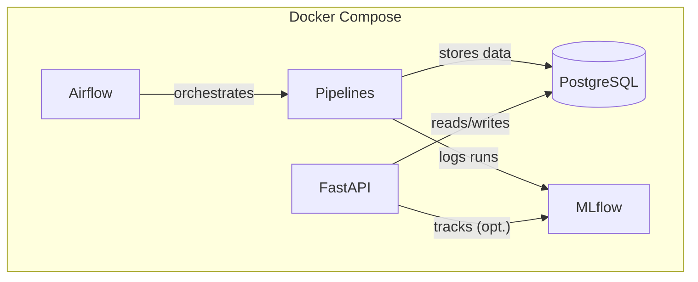

# Architecture

This document describes the system architecture of **news-topics-ner** as it is reproducibly executed from the GitHub repository using **Docker Compose**.

The goal is to provide a clear technical picture of:
- runtime services (Docker Compose),
- code modules (pipelines, API),
- data flow and persistence (PostgreSQL + artifacts),
- orchestration (Airflow) and experiment tracking (MLflow),
- and the main design decisions and constraints.

---

## System overview

At a high level, the system provides two NLP capabilities for news text:

1. **Topic detection**: a classical ML pipeline (TF-IDF + SVD + KMeans) trained on a batch dataset.
2. **Named Entity Recognition (NER)**: spaCy-based entity extraction.

These capabilities are available through:
- **Batch pipelines** (training, inference, ingestion) orchestrated with **Airflow**.
- **Online inference** through a **FastAPI** service.

---

## Deployment model

The repository is designed to run on a single machine using `docker compose` (single-host, local deployment).

### Services (docker-compose)

The `docker-compose.yml` defines the following services:

- **PostgreSQL (`db`)**
  - Container: `news_nlp_db`
  - Image: `postgres:15`
  - Purpose:
    - business data store (`news_nlp`)
    - Airflow metadata DB (`airflow_db`)
    - MLflow backend store (`mlflow_db`)
  - Initialization:
    - `db/postgres-init-docker.sql` creates the three databases + users
    - `db/schema.sql` creates the business tables in `news_nlp`

- **MLflow server (`mlflow`)**
  - Container: `news_nlp_mlflow`
  - Built from: `docker/app.Dockerfile`
  - Purpose:
    - tracking server UI + API
    - backend store in Postgres (`mlflow_db`)
    - artifact store on a Docker volume (`mlflow_artifacts`)

- **FastAPI service (`api`)**
  - Container: `news_nlp_api`
  - Built from: `docker/app.Dockerfile`
  - Purpose:
    - REST API for topics / entities / combined analysis
    - uses Postgres (`news_nlp`) and (optionally) MLflow tracking metadata
  - Note:
    - the repo is bind-mounted into the container (`./:/app`) to keep paths consistent with the repository structure.

- **Airflow (`airflow-init`, `airflow-webserver`, `airflow-scheduler`)**
  - Containers:
    - `news_nlp_airflow_init`
    - `news_nlp_airflow_webserver`
    - `news_nlp_airflow_scheduler`
  - Image: `apache/airflow:2.9.0-python3.10`
  - Executor: `LocalExecutor`
  - Purpose:
    - runs scheduled and manual workflows to execute ingestion/training/inference steps
  - Code exposure:
    - DAGs are mounted at `/opt/airflow/dags` from `./airflow_dags`
    - repo is mounted at `/opt/airflow/news-topics-ner` from `./`
    - `PYTHONPATH` is set to `/opt/airflow/news-topics-ner/src` so Airflow tasks can import `news_nlp`.

### Default ports (from `.env.example`)

- PostgreSQL: `5432`
- Airflow UI: `8080`
- MLflow UI: `5000`
- FastAPI: `8000` (Swagger at `/docs`)

---

## Component diagram

The diagram below is written to be compatible with GitHub Mermaid rendering.

---

## Code architecture

### Python package layout

The core package is `src/news_nlp/`:

- `news_nlp/api/`
  - `app.py`: FastAPI application and endpoints
  - `schemas.py`: Pydantic request/response models
  - `dependencies.py`: dependency injection for services (topics + NER)

- `news_nlp/pipelines/`
  - `01_load_initial_news_pipeline.py`: initial load of batch splits into the DB
  - `02_topics_detector_train_pipeline.py`: training + MLflow logging + DB registration of runs
  - `03_topics_detector_inference_pipeline.py`: topics inference job
  - `04_ner_extractor_inference_pipeline.py`: NER inference job
  - `05_full_inference_pipeline.py`: combined inference (topics + NER) for selected sources

- `news_nlp/ingestion/`
  - `simulated_ingestion.py`: incremental ingestion simulation for `prod`

- `news_nlp/topics_detector/`
  - `model.py`: TF-IDF + SVD + KMeans training and artifact saving
  - `inference.py`: inference using saved artifacts
  - `topics_naming.py`: optional LLM-based naming of topics (OpenAI) using prompts in YAML
  - `db_io.py`, `tables.py`: persistence layer for topics-related results

- `news_nlp/ner_extractor/`
  - `model.py`: spaCy loading/downloading and entity extraction
  - `db_io.py`, `tables.py`: persistence layer for entities

- `news_nlp/db/`
  - `connection.py`: DB connection utilities
  - `init_db.py`: DB initialization utilities (business schema is created by `db/schema.sql` in Docker)

- `news_nlp/config/`
  - `paths.py`: project paths (root-based) used across modules
  - `mlflow_config.py`: MLflow initialization using env vars

---

## Orchestration layer (Airflow)

Airflow DAGs are located in `airflow_dags/`.

### DAG 01 — Initial setup

DAG id: `01_news_topics_ner_initial_setup`

Main tasks (BashOperator):
1. `src/news_nlp/pipelines/01_load_initial_news_pipeline.py`
2. `src/news_nlp/pipelines/02_topics_detector_train_pipeline.py`
3. `src/news_nlp/pipelines/05_full_inference_pipeline.py --mode-topics-detector overwrite --mode-ner-extractor incremental --sources train,test`

This DAG is designed for a first end-to-end run after bringing up Docker services.

### DAG 02 — Retrain

DAG id: `02_news_topics_ner_retrain`

Main tasks (BashOperator):
1. retrain topics detector via `02_topics_detector_train_pipeline.py`
2. recompute inference via `05_full_inference_pipeline.py` (overwrite/incremental modes)

### DAG 03 — Daily ingestion (simulation)

DAG id: `03_news_topics_ner_daily_ingestion`

This DAG simulates a production feed by inserting a fraction of a TSV into the `prod` partition/table view.

Key parameters in code:
- schedule: every 10 minutes (`*/10 * * * *`)
- fraction per run: `0.01`
- logical time alignment:
  - `START_LOGICAL_DT_ISO = "2025-12-01T00:00:00+00:00"`
  - `PERIOD_SECONDS = 600`

Implementation uses a `PythonOperator` calling:
- `news_nlp.ingestion.simulated_ingestion.load_fraction_prod_into_news_table`

### DAG 04 — Daily inference

DAG id: `04_news_topics_ner_daily_inference`

Schedule: every 10 minutes (`*/10 * * * *`)

Runs full incremental inference for the `prod` source:

- `src/news_nlp/pipelines/05_full_inference_pipeline.py --mode-topics-detector incremental --mode-ner-extractor incremental --sources prod`

---

## Data layer

### Databases

A single Postgres instance hosts three databases:

- `news_nlp` (business DB)
- `airflow_db` (Airflow metadata)
- `mlflow_db` (MLflow backend store)

Database creation is performed by:
- `db/postgres-init-docker.sql`

### Business schema (news_nlp)

Tables created by `db/schema.sql`:

- `news`
- `topics_model_training_runs`
- `topics`
- `terms_per_topic`
- `topics_per_news`
- `entities`
- `entities_per_news`

High-level intent:
- `news` is the canonical store for ingested items (train/test/prod)
- model training runs are registered in `topics_model_training_runs`
- inference outputs are stored via junction tables (`topics_per_news`, `entities_per_news`)
- topic and entity dictionaries are maintained in `topics`, `terms_per_topic`, `entities`

---

## Artifact lifecycle

### Topics detector artifacts

Training creates a per-run artifact directory under:

- `models/topics_detector/<run_id>/...` (generated at runtime; not versioned in Git)

Artifacts include:
- `tfidf_vectorizer.joblib`
- `svd.joblib`
- `kmeans.joblib`
- `topics_detector_pipeline.joblib`

### NER model assets (spaCy)

The NER component uses spaCy:
- It can load from a local directory under `models/ner_extractor/...` if present.
- If missing, it can download the configured spaCy model and load it.

These assets are generated at runtime and are not versioned.

### MLflow artifacts

MLflow stores run metadata in Postgres (`mlflow_db`) and artifacts under:

- Docker volume: `mlflow_artifacts`
- Container path: `/mlflow/artifacts`

---

## Key design decisions

1. **Single Postgres instance, multiple databases**
   - Keeps local orchestration simple while logically separating responsibilities (business vs Airflow vs MLflow).

2. **Airflow for reproducible orchestration**
   - DAGs provide a clear, reviewable operational story: initial setup, retrain, ingestion simulation, and incremental inference.

3. **MLflow for experiment traceability**
   - Training runs can log parameters, metrics, and artifacts consistently; UI offers easy inspection during evaluation.

4. **FastAPI for model serving**
   - Provides a clear and testable inference interface (`/v1/topics`, `/v1/entities`, `/v1/analyze`).

5. **Artifacts generated at runtime (not committed)**
   - Avoids bloating the repository; reproducibility is achieved by re-running pipelines from a clean clone.

---

## Constraints and non-goals

- Single-host Docker Compose (no HA, no scaling, no Kubernetes)
- No authentication/authorization layer on the API
- No secrets management beyond `.env` (local-only)
- Not optimized for large-scale throughput; designed for technical evaluation and clarity

---

## Related documents

- [docs/SETUP_AND_DEPLOYMENT.md](docs/SETUP_AND_DEPLOYMENT.md)
- [docs/PIPELINES_AND_DAGS.md](docs/PIPELINES_AND_DAGS.md)
- [docs/MODELING_AND_EVALUATION.md](docs/MODELING_AND_EVALUATION.md)
- [docs/API_REFERENCE.md](docs/API_REFERENCE.md)
- [docs/TROUBLESHOOTING.md](docs/TROUBLESHOOTING.md)
- [docs/DECISIONS.md](docs/DECISIONS.md)